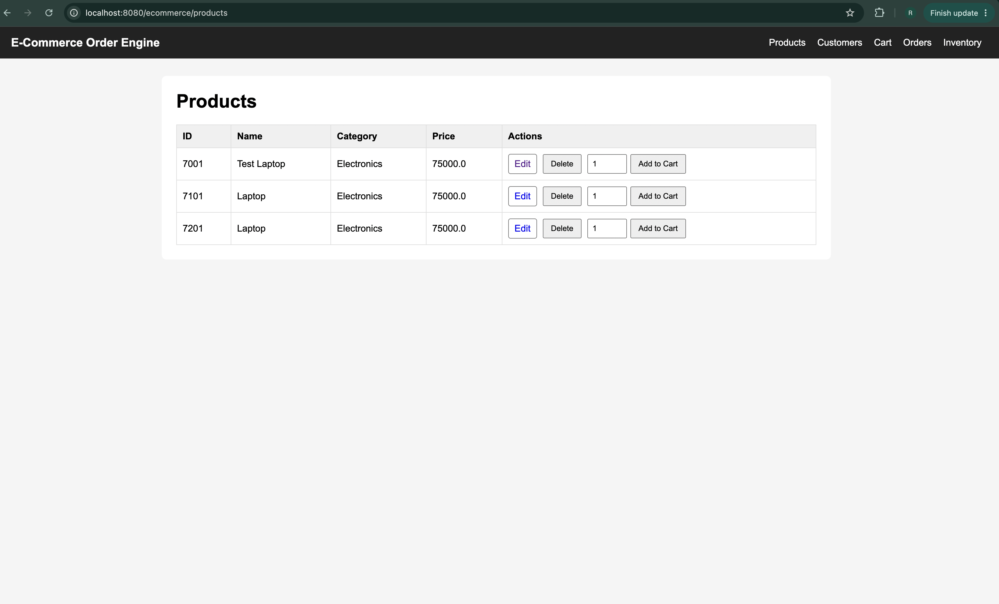
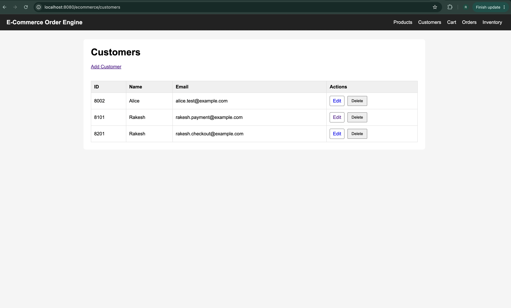
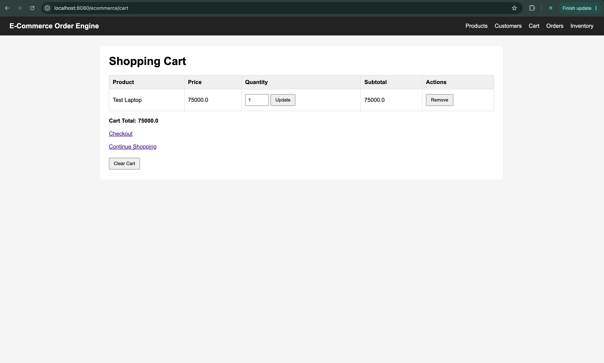
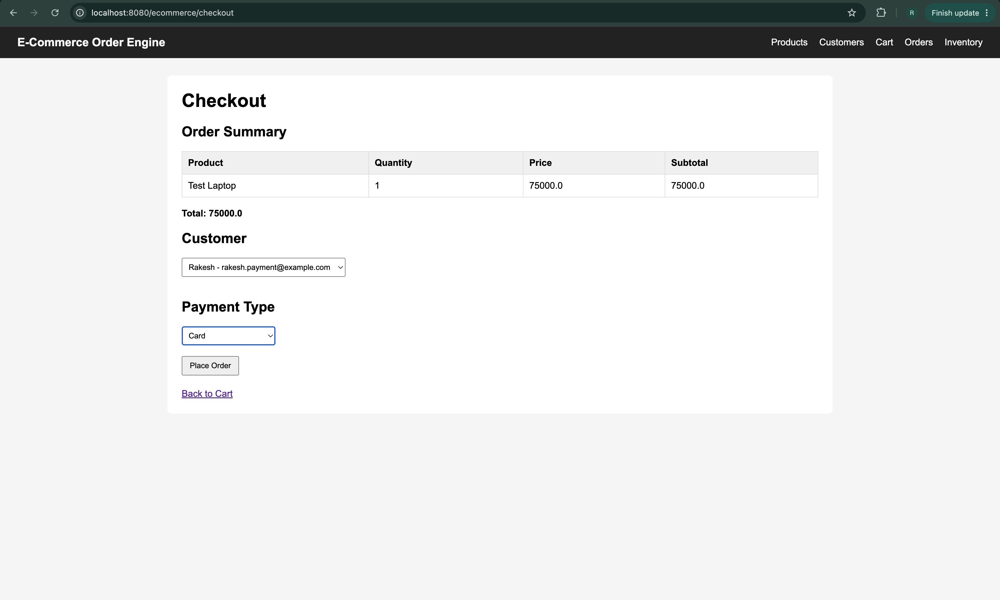
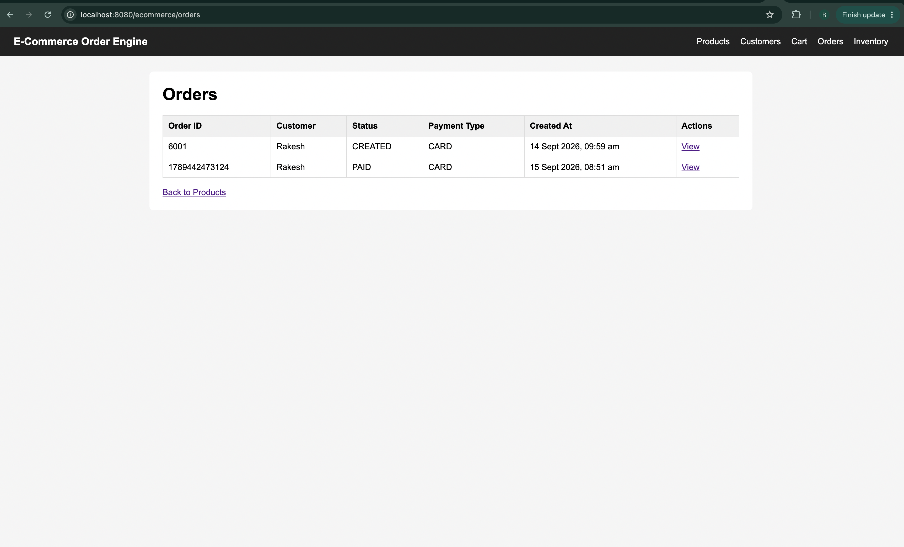
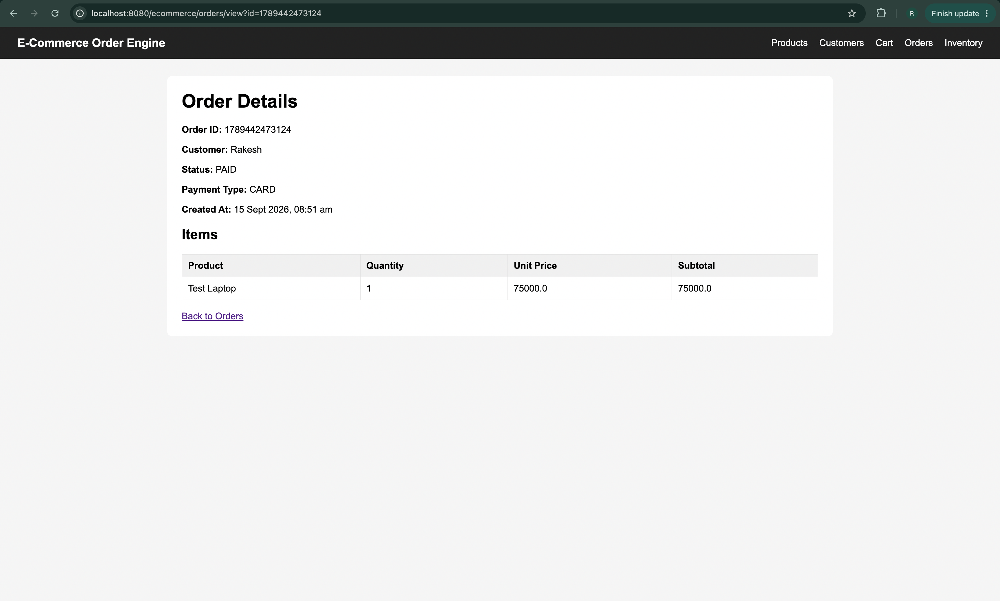
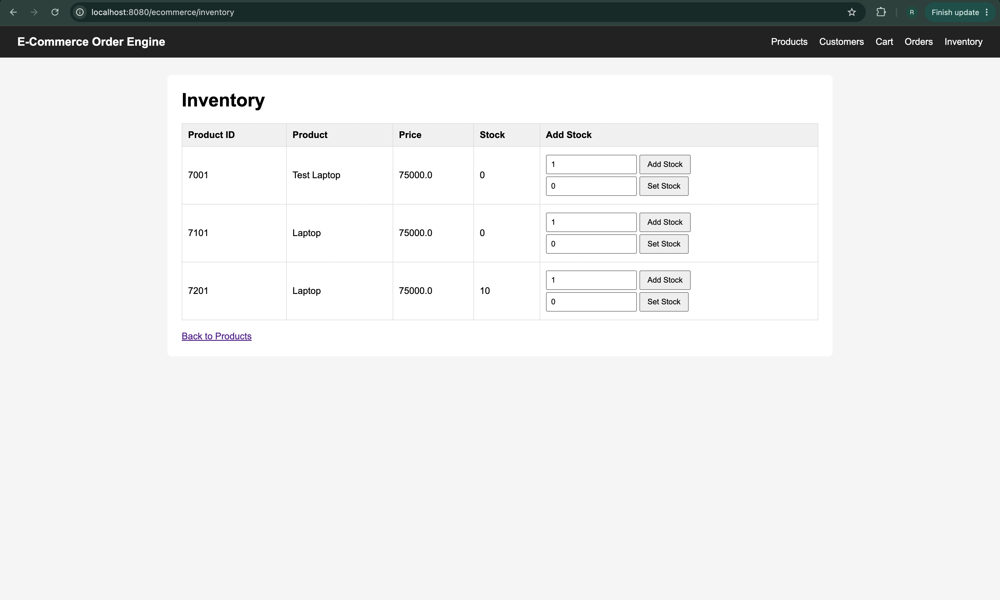
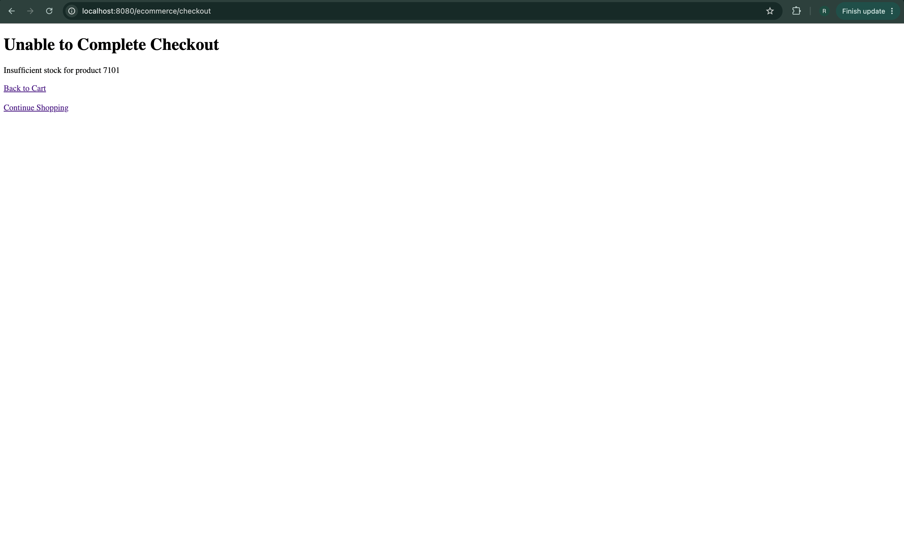

# High-Throughput E-Commerce Order Processing & Analytics Engine

## Overview

`ECommerceOrderEngine` is a Java-based e-commerce backend project designed to demonstrate the progressive development of an order-processing system from Core Java to database-backed application architecture.

The project currently contains three major versions:

- **V1 – Core Java:** In-memory inventory, payment strategies, concurrent checkout processing, notifications, analytics, file persistence, and serialization.
- **V2 – Maven + JDBC + MySQL:** Relational database persistence, repository pattern, JDBC transactions, atomic inventory reservation, rollback handling, and database-level concurrency control.
- **V3 – Servlets + JSP + Tomcat:** Server-rendered web application with Product and Customer CRUD, session-based cart management, transactional checkout, order and inventory views, JSTL/EL, friendly error handling, shared navigation/CSS, and isolated development/test databases.

The project focuses on object-oriented design, SOLID principles, design patterns, concurrency, database programming, transaction management, exception handling, and automated testing.

---

## V1 – Core Java

V1 implements the order-processing system using Core Java and in-memory data structures.

### Features

- Product and customer management
- Shopping cart operations
- In-memory inventory management
- Thread-safe inventory reservation
- Concurrent checkout processing
- Card, UPI, and Wallet payment strategies
- Checkout rollback handling
- Order creation using Builder pattern
- Payment Strategy pattern
- Payment Factory
- Observer-based order notifications
- Analytics processing
- CSV persistence
- Java serialization
- Custom exceptions
- Unit and concurrency testing

### Core Java Concepts

- Object-Oriented Programming
- Java Collections Framework
- Streams API
- Lambda Expressions
- Optional
- Exception Handling
- File I/O
- Java Serialization
- ConcurrentHashMap
- ExecutorService
- CountDownLatch
- AtomicInteger
- JUnit 5
- SOLID Principles
- Design Patterns

---

# V2 – Maven + JDBC + MySQL

V2 extends the Core Java application by introducing persistent relational storage and transaction-based checkout processing.

Instead of storing application state only in memory, products, customers, inventory, orders, order items, and payments are now persisted in MySQL.

## V2 Features

- Maven-based project structure
- MySQL database integration
- JDBC connectivity
- Repository pattern
- Product CRUD operations
- Customer CRUD operations
- Persistent inventory management
- Atomic stock reservation
- Persistent orders and order items
- Payment persistence
- SQL JOIN queries
- Batch insertion of order items
- JDBC transaction management
- Commit and rollback handling
- Foreign key constraints
- Database validation constraints
- Concurrent database checkout processing
- Prevention of inventory overselling
- Environment-variable based database credentials
- Database integration testing
- 206 automated tests

---

## V2 Architecture

```text
                    Application
                         |
                         v
                JdbcCheckoutService
                         |
          +--------------+---------------+
          |              |               |
          v              v               v
 InventoryRepository  OrderRepository  PaymentRepository
          |              |               |
          v              v               v
 JdbcInventoryRepo   JdbcOrderRepo   JdbcPaymentRepo
          |              |               |
          +--------------+---------------+
                         |
                         v
                        JDBC
                         |
                         v
                       MySQL
```

The checkout service contains the business workflow, while repositories handle SQL and persistence operations.

```text
Business Logic
    |
    v
JdbcCheckoutService

Persistence Logic
    |
    v
JDBC Repositories

Database
    |
    v
MySQL
```

---

## Transactional Checkout

V2 performs checkout using a single JDBC connection and database transaction.

```text
BEGIN TRANSACTION
       |
       v
Reserve Inventory
       |
       v
Calculate Order Total
       |
       v
Process Payment
       |
       v
Create Order
       |
       v
Save Order
       |
       v
Save Order Items
       |
       v
Save Payment
       |
       v
COMMIT
```

If any step fails:

```text
Failure
   |
   v
ROLLBACK
```

This prevents partial updates such as inventory being reduced without an order being created.

---

## ACID Transaction Concepts

The checkout implementation demonstrates important ACID transaction properties.

```text
Atomicity
→ Checkout operations succeed together or are rolled back together.

Consistency
→ Foreign keys, CHECK constraints, and validation keep the database valid.

Isolation
→ Concurrent checkout transactions do not oversell inventory.

Durability
→ Successfully committed orders and payments remain persisted in MySQL.
```

---

## Concurrency and Atomic Inventory Reservation

Inventory reservation is performed using an atomic SQL statement:

```sql
UPDATE inventory
SET quantity = quantity - ?
WHERE product_id = ?
  AND quantity >= ?;
```

This prevents multiple concurrent checkout requests from purchasing more stock than is available.

A concurrency integration test executes:

```text
Initial inventory: 50

100 concurrent checkout attempts
20 worker threads

Result:

50 successful checkouts
50 rejected due to insufficient stock
0 unexpected errors

Final inventory: 0
Orders committed: 50
Payments committed: 50
```

---

## Repository Pattern

V2 separates business logic from database persistence using repository interfaces and JDBC implementations.

```text
ProductRepository
    |
    └── JdbcProductRepository

CustomerRepository
    |
    └── JdbcCustomerRepository

InventoryRepository
    |
    └── JdbcInventoryRepository

OrderRepository
    |
    └── JdbcOrderRepository

PaymentRepository
    |
    └── JdbcPaymentRepository
```

Repositories are responsible for operations such as:

```text
INSERT
SELECT
UPDATE
DELETE
ResultSet mapping
PreparedStatement handling
```

The checkout service focuses on the business workflow instead of containing SQL directly.

---

## Design Patterns

The project applies several design patterns.

```text
Repository Pattern
→ Separates persistence logic from application/business logic.

Strategy Pattern
→ Card, UPI, and Wallet payment implementations.

Factory Pattern
→ PaymentFactory selects the appropriate payment strategy.

Builder Pattern
→ Used to construct Order objects.

Observer Pattern
→ Used in V1 for notifications and analytics.

Dependency Injection
→ Repositories and payment processor factories are supplied to services.

Functional Factory Injection
→ Function<PaymentType, PaymentProcessor> improves payment testability.
```

---

## SOLID Principles

The project applies SOLID principles where appropriate.

```text
Single Responsibility Principle
→ Repositories, checkout services, payment processors, and database
  connection utilities have separate responsibilities.

Open/Closed Principle
→ New payment strategies can be added without rewriting PaymentProcessor.

Liskov Substitution Principle
→ Repository implementations follow repository contracts.

Interface Segregation Principle
→ Product, Customer, Inventory, Order, and Payment persistence use
  separate focused interfaces.

Dependency Inversion Principle
→ Partially applied through abstractions and dependency injection.
  JdbcCheckoutService currently uses concrete JDBC repositories because
  shared Connection objects are required for manual JDBC transaction control.
```

A future Spring version can improve this further using framework-managed transactions such as `@Transactional`.

---

## Database Schema

The database schema is stored in:

```text
src/main/resources/schema.sql
```

The schema contains the following tables:

```text
products
customers
inventory
orders
order_items
payments
```

Main relationships:

```text
customers
    |
    v
orders
    |
    +-----------> order_items
    |
    +-----------> payments

products
    |
    +-----------> inventory
    |
    +-----------> order_items
```

`order_items` and `payments` use `ON DELETE CASCADE` when their associated order is deleted.

---

## Project Structure

```text
ECommerceOrderEngine/
│
├── pom.xml
│
├── src/
│   ├── main/
│   │   ├── java/
│   │   │   └── com/ecommerce/
│   │   │       │
│   │   │       ├── analytics/
│   │   │       │
│   │   │       ├── checkout/
│   │   │       │   ├── CheckoutService.java
│   │   │       │   └── JdbcCheckoutService.java
│   │   │       │
│   │   │       ├── database/
│   │   │       │   └── DatabaseConnection.java
│   │   │       │
│   │   │       ├── exception/
│   │   │       │   ├── InsufficientStockException.java
│   │   │       │   └── PaymentFailedException.java
│   │   │       │
│   │   │       ├── inventory/
│   │   │       │
│   │   │       ├── model/
│   │   │       │   ├── Cart.java
│   │   │       │   ├── CartItem.java
│   │   │       │   ├── Customer.java
│   │   │       │   ├── Order.java
│   │   │       │   ├── OrderItem.java
│   │   │       │   ├── OrderStatus.java
│   │   │       │   ├── PaymentType.java
│   │   │       │   └── Product.java
│   │   │       │
│   │   │       ├── notification/
│   │   │       │
│   │   │       ├── payment/
│   │   │       │   ├── CardPaymentStrategy.java
│   │   │       │   ├── PaymentFactory.java
│   │   │       │   ├── PaymentProcessor.java
│   │   │       │   ├── PaymentResult.java
│   │   │       │   ├── PaymentStrategy.java
│   │   │       │   ├── UpiPaymentStrategy.java
│   │   │       │   └── WalletPaymentStrategy.java
│   │   │       │
│   │   │       ├── persistence/
│   │   │       │
│   │   │       ├── repository/
│   │   │       │   ├── ProductRepository.java
│   │   │       │   ├── JdbcProductRepository.java
│   │   │       │   ├── CustomerRepository.java
│   │   │       │   ├── JdbcCustomerRepository.java
│   │   │       │   ├── InventoryRepository.java
│   │   │       │   ├── JdbcInventoryRepository.java
│   │   │       │   ├── OrderRepository.java
│   │   │       │   ├── JdbcOrderRepository.java
│   │   │       │   ├── PaymentRepository.java
│   │   │       │   └── JdbcPaymentRepository.java
│   │   │       │
│   │   │       └── web/
│   │   │           ├── ProductServlet.java
│   │   │           ├── CustomerServlet.java
│   │   │           ├── CartServlet.java
│   │   │           ├── CheckoutServlet.java
│   │   │           ├── OrderServlet.java
│   │   │           ├── OrderViewServlet.java
│   │   │           └── InventoryServlet.java
│   │   │
│   │   ├── resources/
│   │   │   └── schema.sql
│   │   │
│   │   └── webapp/
│   │       ├── css/
│   │       │   └── styles.css
│   │       └── WEB-INF/
│   │           └── views/
│   │               ├── includes/
│   │               │   └── header.jsp
│   │               ├── products.jsp
│   │               ├── customers.jsp
│   │               ├── cart.jsp
│   │               ├── checkout.jsp
│   │               ├── orders.jsp
│   │               ├── order-details.jsp
│   │               └── inventory.jsp
│   │
│   └── test/
│       └── java/
│           └── com/ecommerce/
│
├── docs/
│   └── screenshots/
│
└── README.md
```

---

## Database Configuration

The application uses environment variables for database configuration.

The database password must not be committed to source control.

Example:

```bash
read -s "ECOMMERCE_DB_PASSWORD?MySQL password: "
export ECOMMERCE_DB_PASSWORD
```

The application also supports:

```text
ECOMMERCE_DB_URL
ECOMMERCE_DB_USER
ECOMMERCE_DB_PASSWORD
```

Default database configuration:

```text
Database: ecommerce_db
Host: localhost
Port: 3306
```

---

## Running Tests

Run the complete test suite with:

```bash
mvn test
```

Current automated test status:

```text
Tests: 206
Failures: 0
Errors: 0
```

The test suite runs against the isolated `ecommerce_test_db` and includes:

```text
Unit tests
Repository integration tests
Database transaction tests
Rollback tests
Inventory concurrency tests
Concurrent checkout tests
Payment failure tests
Insufficient stock tests
```

---

## Key Concepts Demonstrated

```text
Maven
JDBC
MySQL
PreparedStatement
ResultSet
Optional
Repository Pattern
CRUD
SQL JOINs
Foreign Keys
Database Constraints
Batch Operations
Transactions
Commit / Rollback
ACID Properties
Atomic SQL Updates
Concurrency Control
ExecutorService
CountDownLatch
AtomicInteger
Integration Testing
Dependency Injection
SOLID Principles
Design Patterns
Jakarta Servlets
JSP
JSTL
Expression Language (EL)
HttpSession
WAR Packaging
Apache Tomcat
MVC-style Web Layer
Friendly HTTP Error Handling
Development/Test Database Isolation
```

---

# V3 – Servlets + JSP + Tomcat

V3 turns the JDBC-backed application into a server-rendered web application deployed as a WAR on Apache Tomcat.

The existing V2 domain, repository, payment, inventory, and transactional checkout logic are reused rather than duplicated in the web layer.

## V3 Features

- Apache Tomcat deployment using WAR packaging
- Jakarta Servlet API
- JSP views
- JSTL and Expression Language (EL)
- Product web CRUD
- Customer web CRUD
- Session-based shopping cart using `HttpSession`
- Add, update, remove, and clear cart operations
- Customer and payment selection during checkout
- Transactional web checkout through `JdbcCheckoutService`
- Atomic inventory reservation
- Payment processing using Card, UPI, and Wallet strategies
- Order success page
- Order history and order-detail pages
- Order creation date/time display
- Inventory dashboard
- Add-stock and set-stock operations
- Friendly checkout and constraint-error pages
- Shared navigation and CSS
- Separate development and automated-test databases

## V3 Web Architecture

```text
                         Browser
                            |
                            v
                     Apache Tomcat
                            |
                            v
                         Servlets
                            |
                +-----------+-----------+
                |                       |
                v                       v
         JSP + JSTL + EL          Application Services
                                         |
                                         v
                               JdbcCheckoutService
                                         |
                           +-------------+-------------+
                           |             |             |
                           v             v             v
                     InventoryRepo   OrderRepo    PaymentRepo
                           |             |             |
                           +-------------+-------------+
                                         |
                                         v
                                        JDBC
                                         |
                                         v
                                       MySQL
```

The Servlets handle HTTP input, request/session state, routing, and preparation of view data. JSP pages are responsible for presentation, while existing services and repositories continue to contain business and persistence logic.

## Servlet and JSP Flow

```text
Browser Request
      |
      v
Servlet
      |
      +--> Validate request parameters
      |
      +--> Call repository/service
      |
      +--> Store data in request/session
      |
      v
JSP
      |
      +--> JSTL for loops/conditions
      |
      +--> EL for object properties
      |
      v
HTML Response
```

The main JSP pages are scriptlet-free and use JSTL + EL instead of embedding Java code directly in the view layer.

## Product and Customer CRUD

V3 exposes browser-based CRUD flows for products and customers.

```text
Products
GET  /products
GET  /products/new
POST /products
GET  /products/edit?id=...
POST /products/edit
POST /products/delete

Customers
GET  /customers
GET  /customers/new
POST /customers
GET  /customers/edit?id=...
POST /customers/edit
POST /customers/delete
```

Foreign-key conflicts are handled without weakening database constraints. Referenced products and customers return a friendly conflict page instead of exposing the default Tomcat error page.

## Session-Based Shopping Cart

The shopping cart is stored in `HttpSession`, allowing cart contents to survive across multiple HTTP requests for the same browser session.

```text
POST /cart/add
GET  /cart
POST /cart/update
POST /cart/remove
POST /cart/clear
```

```text
Browser
   |
   | JSESSIONID
   v
Tomcat HttpSession
   |
   └── cart
       ├── CartItem
       ├── CartItem
       └── CartItem
```

The existing `Cart` API is reused for add, remove, quantity-update, subtotal, and total calculations.

## Web Checkout

The checkout page reads the cart from the session and allows the user to select a customer and payment type.

```text
Session Cart
     |
     v
GET /checkout
     |
     v
Select Customer + Payment Type
     |
     v
POST /checkout
     |
     v
JdbcCheckoutService
     |
     +--> Reserve inventory
     +--> Calculate total
     +--> Process payment
     +--> Create order
     +--> Persist order/items
     +--> Persist payment
     |
     v
COMMIT
```

On success, the cart is removed from the session only after the transaction commits.

If checkout fails:

```text
Failure
   |
   v
ROLLBACK
   |
   +--> Inventory changes reversed
   +--> Order/payment not committed
   +--> Session cart preserved
```

## Orders UI

V3 provides browser-based order history and order details.

```text
GET /orders
GET /orders/view?id=...
```

Order details include:

- Order ID
- Customer
- Status
- Payment type
- Creation date/time
- Purchased products
- Quantity
- Historical unit price
- Subtotal

## Inventory UI

The inventory dashboard displays current stock for each product and provides two distinct operations:

```text
Add Stock
→ Increase existing quantity

Set Stock
→ Replace the current quantity, including setting it to 0
```

Checkout uses the same atomic stock-reservation logic introduced in V2.

## Friendly Error Handling

V3 replaces several raw Tomcat error pages with application-level views.

Handled cases include:

- Insufficient stock during checkout
- Payment failure
- Invalid checkout input
- Duplicate customer ID/email
- Referenced product deletion
- Referenced customer deletion
- Invalid order ID
- Missing order

The application preserves appropriate HTTP status codes such as `400`, `404`, and `409` while rendering a more useful response body.

## Development and Test Database Isolation

The running Tomcat application uses:

```text
ecommerce_db
```

Automated Maven/JUnit tests use:

```text
ecommerce_test_db
```

The same `schema.sql` is applied to both databases, but their data remains independent.

```text
Tomcat / Manual Testing
        |
        v
   ecommerce_db


Maven / JUnit
        |
        v
ecommerce_test_db
```

Maven Surefire supplies the test database URL through `ECOMMERCE_DB_URL`, while the application falls back to the normal development database when the override is not present.

This prevents automated test cleanup from deleting or conflicting with manually created development data.

## Running V3 Locally

Build the application:

```bash
mvn clean package
```

The WAR is generated at:

```text
target/ecommerce-order-engine-3.0-SNAPSHOT.war
```

Set the database password:

```bash
read -s "ECOMMERCE_DB_PASSWORD?MySQL password: "
export ECOMMERCE_DB_PASSWORD
```

Deploy the WAR to Tomcat as `ecommerce.war`:

```bash
rm -rf "$CATALINA_HOME/webapps/ecommerce"
rm -f "$CATALINA_HOME/webapps/ecommerce.war"

cp target/ecommerce-order-engine-3.0-SNAPSHOT.war \
   "$CATALINA_HOME/webapps/ecommerce.war"

"$CATALINA_HOME/bin/startup.sh"
```

Open:

```text
http://localhost:8080/ecommerce/products
```

## V3 Screenshots

### Products



### Customers



### Shopping Cart



### Checkout



### Orders



### Order Details



### Inventory



### Checkout Error Handling




---

## Future Improvements

Future versions of the project will progressively introduce:

```text
Hibernate
JPA
Spring Core
Spring Boot
REST APIs
Spring Data JPA
Spring Security
Redis
Kafka
Docker
Microservices
Cloud Deployment
CI/CD
```

Other technical improvements may include:

```text
BigDecimal for monetary values
Connection pooling
Optimized order fetching
Improved transaction abstraction
External payment idempotency
Outbox / Saga patterns
Testcontainers
```

---

## Version Roadmap

```text
V1  Core Java                  
V2  Maven + JDBC + MySQL         
V3  Servlets + JSP + Tomcat
V4  Hibernate + JPA           
V5  Spring Core + Spring Boot
V6  REST APIs + Spring Data JPA
V7  Spring Security
V8  Advanced Integration Testing
V9  Docker
V10 Redis + Kafka + Microservices
V11 Cloud + CI/CD